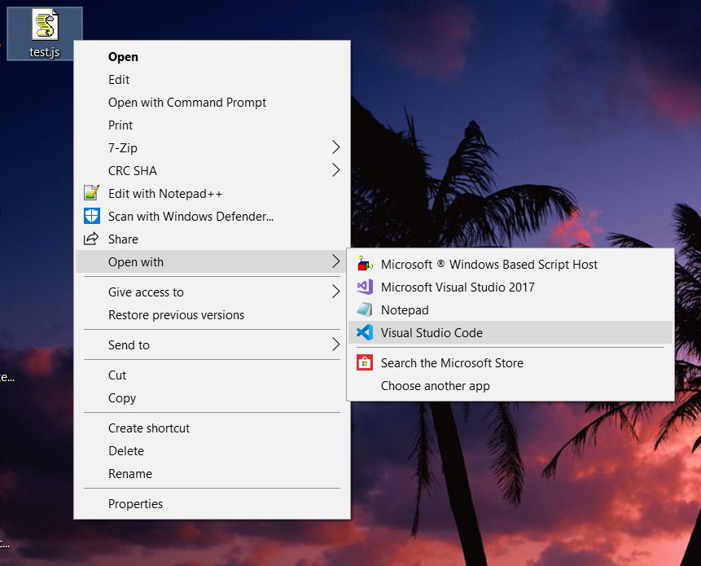

# JS sprint
Welcome to README!! read through this to make your own set-up of JS compiler.

## 🚀 Let's start

1. **Install Node & VScode**

    Let's install these two (click to the images)
    

      
      
    

  > To see if you successfully installed Node.js, open terminal in Mac or Command Prompt in Windows
  > type `node -v`. You should see the log says `v12.3.4` or whatever version your Node.js is.
  

2. **Create JS file**

    - Create a plain text file in your Desktop (`C:\Users\<YOUR_USER_NAME>\Desktop>`)
    - Rename it 
    

    > Your file extension must have `.js` at the end 

3. **Open file in VScode**

    **Open with -> Visual Studio Code**
    

    Navigate to **terminal-> new terminal** in VScode
    

4. **Code and compile**
    - Write something in your **test.js** file, in my case I write `console.log('hello world!')`

    - Write in the terminal (*aka* ***console***) `node test.js`

    > make sure your directory is correct, it must be `C:\Users\<YOUR_USER_NAME>\Desktop>`
    > If it's not correct, run `cd C:\Users\<YOUR_USER_NAME>\Desktop>`
    > `cd` stands for ***change directory*** 
    It should print your console.log
    

# 🔥 OFF YOU GO!
  Whenever you want to run your code, just repeat step #4

# 📝 RECAP 
  - Node.js is a JavaScript runtime environment that executes JavaScript code outside of a browser (on your server). If Node.js is not installed, you can't run `node <YOUR_COMMAND>` in your terminal  💻 
  - VScode: all web developers in the world use this IDE (Integrated Development Environment) 😋
  - Run JS on Node server is very useful for practising exercises 🏃
